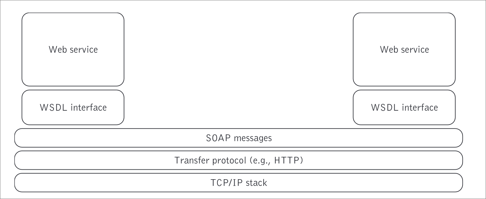
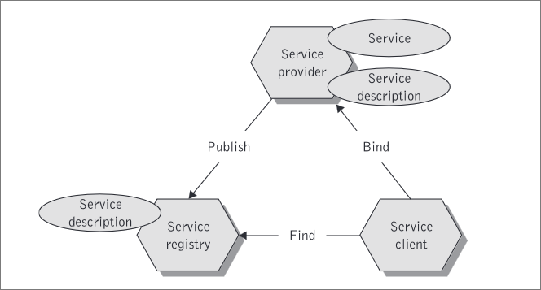

# 2 mark

### 1. Discuss Advantages of SOAP.

The primary advantages of SOAP are summarized as follows:

1. **Portability**: Platform-independent, with XML parsers available on nearly all platforms.
2. **Firewall-friendly**: Uses HTTP, allowing it to pass through firewalls easily.
3. **Open standards**: Utilizes XML, making it extendable and well-supported.
4. **Interoperability**: Built on open technologies, facilitating communication between diverse systems.
5. **Universal acceptance**: Widely accepted in the message communication domain.

### 2. Write a brief note on Soap envelope.

A SOAP envelope is the root element of a SOAP message, encapsulating the entire message and defining its structure. 

It consists of two main parts: the optional Header element, which carries application-specific information like authentication, and the mandatory Body element, which contains the actual message data in XML format. 

The SOAP envelope ensures standardized, extensible, and structured communication in web services.

### 3. Define and discuss Web Service.

A web service is a software system that allows different applications to communicate over a network using open standards like XML, SOAP, WSDL, and UDDI. 

It enables interoperability between diverse systems, allowing them to exchange data regardless of the underlying platforms or languages. 

Web services are modular, reusable, and can be accessed over the internet, facilitating integration and scalable communication between applications.

### 4. Draw Diagram of SOAP Web services communication and messaging network.



### 5. Draw neat and schematic the diagram of Operation of SOA.



### 6. Explain Bind Operation in SOP.

The bind operation in web services involves the service requestor invoking the web service at run-time using the binding details from the service description. This is the final and most crucial step, where the technical information entered by the service provider in the registry is utilized. There are two ways to perform this invocation: 

1. **Direct Invocation**: The service requestor directly calls the web service using the technical details from the service description.
2. **Mediated Invocation**: The communication between the requestor and provider is routed through a discovery agency, using the registry information.

Both methods ensure the service requestor can locate and interact with the web service effectively.

### 7. Explain Distributed application processing with SOAP can be achieved in terms of the basic steps

Distributed application processing with SOAP involves several steps to enable communication between different systems over a network:

1. **Define and Deploy the Service**: Create a web service using a WSDL file that describes the service operations and deploy it on a server, making the service accessible via a URL.

2. **Client Interaction**: Generate a client-side proxy from the WSDL file. The client constructs a SOAP request message, sends it over HTTP to the server, which processes the request and returns a SOAP response. The client then processes the response.

These steps facilitate seamless and interoperable communication across diverse systems using SOAP's standardized XML-based messaging protocol.

### 8. Explain in short Loose Coupling?

Loose coupling is a design principle where components or systems interact with minimal dependency on each other. 

This allows for independent updates or changes without affecting other components, promoting flexibility and scalability.

 In web services, loose coupling is achieved through standardized communication protocols, enabling modular and resilient interactions.

### 9. Explain one Complex services that compose interactive Web services.

A complex service that composes interactive Web services is an **Order Management Service**. It integrates various sub-services to manage the entire order lifecycle:

1. **Order Placement**: Customers place orders via a web interface, which is validated by the Order Entry Service.
2. **Inventory Check**: The Inventory Management Service checks and reserves stock.
3. **Payment Processing**: The Payment Gateway Service handles secure payment transactions.
4. **Order Fulfillment**: The Warehouse Management Service prepares the order, and the Shipping Service manages dispatch.
5. **Notifications**: The Notification Service updates customers at each step via email or SMS.
6. **Customer Support**: A portal allows customers to track orders and request changes.

Technologies involved include SOAP for message exchanges, WSDL for interface definitions, and XML for structured data. This setup ensures interoperability, scalability, flexibility, and real-time processing.

### 10. Explain one Simple or informational Web Service.

A simple or informational Web Service example is a **Weather Service**. This service provides weather information to users or applications. Here’s how it typically works:

1. **Request**: A client application sends a request to the Weather Service, often specifying parameters like location (city or coordinates) and type of information needed (current weather, forecast).
2. **Response**: The Weather Service processes the request and retrieves the relevant weather data from its database or a third-party provider.
3. **Data Delivery**: The service sends the weather data back to the client in a structured format such as XML or JSON.

The Weather Service might use SOAP for exchanging messages and WSDL to define its operations, ensuring that any client can interact with it in a standard way. This service is simple because it primarily delivers data without complex transactions or interactions.

### 11. List Some of design criteria of SOAP.

Design criteria for wire protocols like SOAP include:

1. **Compactness**: The degree to which the protocol minimizes the size of the network package while conveying information. Higher compactness is typically preferred for efficiency.

2. **Protocol Efficiency**: Measures how efficiently the protocol sends data, with less overhead indicating higher efficiency.

3. **Coupling**: The extent to which client applications need to adapt to changes. Loosely coupled protocols are more flexible and easier to update.

4. **Scalability**: The protocol's ability to handle a large number of recipients, from a few hundred to millions.

5. **Interoperability**: The protocol’s capability to work across various computing platforms and systems, enabling communication between diverse systems.

### 12. What do you mean by Service Granularity in Web Service, Describe.

**Service Granularity** in Web Services refers to the degree of functional relatedness of operations within a service. 

High cohesion, a key aspect of service granularity, means that the operations within a service are strongly related and work together to perform a single task or a set of closely related tasks. 

This makes the service easier to understand, maintain, and reuse. For example, in an order management process, services like "get product price" and "check product availability" are cohesive as they are related to managing orders.

### 13. What is one way and two way web service.

In web services, "one-way" and "two-way" refer to the communication patterns between a client and a service. Here's a brief explanation of each:

1. One-Way Web Service
   
   - **Definition**: In a one-way web service, the client sends a request to the server, and the server processes the request without sending a response back to the client. 

2. Two-Way Web Service
   
   - **Definition**: In a two-way web service, the client sends a request to the server, and the server processes the request and sends a response back to the client. T

### 14. What is Web Service publisher?

A Web Service Publisher defines and makes a web service available by creating its description (e.g., using WSDL), registering it in a directory (e.g., UDDI), and deploying it on a server. 

The publisher ensures that the service is discoverable and accessible for use by other systems.

# 5 marks

### 1. Concept of Software as Service Elaborate.

The concept of Software as a Service (SaaS) is revolutionary and represents a significant shift from traditional software deployment methods. It builds on the idea of providing software over the Internet, making it accessible from anywhere without the need for local installations or infrastructure management by the end-user.

**Key Characteristics of SaaS**

1. **Hosted Applications**: SaaS applications are hosted centrally by a service provider and delivered to users over the Internet. Users do not need to install or maintain the software on their local devices.

2. **Subscription-Based Model**: SaaS typically follows a subscription-based model, where users pay a recurring fee (monthly or annually) to access the software. This contrasts with traditional software that often required a one-time purchase and installation.

3. **Accessibility and Convenience**: SaaS applications can be accessed from any device with an Internet connection, providing flexibility and convenience. Users can work from anywhere without being tied to a specific location.

4. **Automatic Updates**: The service provider handles software updates and maintenance, ensuring that users always have access to the latest features and security patches without needing to manually update the software.

5. **Scalability**: SaaS solutions are scalable, allowing businesses to adjust their usage based on their needs. They can easily add or remove users and features as required.

#### Evolution from ASP to SaaS

The concept of SaaS evolved from the earlier Application Service Provider (ASP) model. ASPs provided packaged software solutions hosted and managed by a third-party service provider. However, ASPs had several limitations:

- Limited customization and flexibility.
- Highly interactive applications were difficult to develop.
- Monolithic architectures with tight coupling, making integration and updates challenging.

SaaS overcomes these limitations by offering:

- **Modular and Loosely Coupled Services**: SaaS applications are designed with modularity in mind, allowing for more flexibility and easier integration with other services.
- **Customizability**: Users can often customize their experience within the SaaS platform to better meet their specific needs.
- **Interoperability**: SaaS solutions are built using standards like XML and Web services, enabling better communication and integration with other applications and systems.

#### Benefits of SaaS

1. **Cost-Effective**: SaaS eliminates the need for expensive hardware and software purchases, reducing upfront costs. The subscription model spreads costs over time.
2. **Easy Implementation**: Quick deployment and setup, as there is no need for complex installations.
3. **Maintenance-Free**: Service providers handle all maintenance, updates, and security, reducing the burden on IT departments.
4. **Enhanced Collaboration**: SaaS applications often include collaboration tools, allowing multiple users to work together in real-time.

### 2. Discuss All properties of Web Service.

Web services have several properties that define their behavior, capabilities, and interactions. These properties ensure that web services can be discovered, described, and interacted with effectively. Here are the key properties of web services:

1. **Interoperability:**
   
   - Web services are designed to work across different platforms and programming languages. They use standard protocols such as HTTP, XML, and SOAP, ensuring compatibility and communication between disparate systems.

2. **Standardized Protocols:**
   
   - Web services use standardized protocols for communication, such as SOAP (Simple Object Access Protocol) for messaging and WSDL (Web Services Description Language) for describing the services. RESTful web services use standard HTTP methods (GET, POST, PUT, DELETE).

3. **Loose Coupling:**
   
   - Web services are loosely coupled, meaning that the service interface is independent of the implementation. This allows services to evolve without breaking existing clients that use them.

4. **Reusability:**
   
   - Web services can be reused across different applications and projects. Once a service is created, it can be accessed and utilized by multiple clients, promoting code reuse and reducing redundancy.

5. **Discoverability:**
   
   - Web services can be discovered using service registries like UDDI (Universal Description, Discovery, and Integration). This allows clients to find and bind to services dynamically at runtime.

6. **Self-Describing:**
   
   - Web services are self-describing through WSDL documents in the case of SOAP-based services. These documents provide details about the service interface, operations, input and output parameters, and protocols used.

7. **Scalability:**
   
   - Web services can be scaled horizontally by deploying additional instances of the service. This allows them to handle increased load and provide better performance.

8. **Modularity:**
   
   - Web services promote modular design. Complex applications can be broken down into smaller, independent services that can be developed, deployed, and maintained separately.

9. **Platform and Language Agnostic:**
   
   - Web services can be implemented and consumed using different programming languages and platforms. This cross-platform support is a key advantage in heterogeneous environments.

10. **Statelessness:**
    
    - Web services are typically stateless, meaning that each request from a client to the server must contain all the information needed to understand and process the request. This property enhances scalability and reliability.

### 3. Discuss Service Oriented Architecture.

**Service-Oriented Architecture (SOA)** is an architectural pattern in software design that emphasizes the use of services to support the requirements of software users. These services are designed to be reusable, loosely coupled, and can be combined and orchestrated to create complex, scalable, and interoperable systems. Here’s an in-depth discussion on SOA:

**Key Concepts of SOA:**

1. **Service**:
   
   - A service is a discrete unit of functionality that can be accessed remotely and acted upon independently. Each service performs a specific task and offers a well-defined interface.
   - Services can be reused across different applications and business processes, enhancing efficiency and reducing redundancy.

2. **Loose Coupling**:
   
   - SOA promotes loose coupling between services, meaning that services are designed to interact with each other with minimal dependencies.
   - This reduces the impact of changes in one service on other services, enhancing the flexibility and maintainability of the system.

3. **Interoperability**:
   
   - Services in SOA communicate using standard protocols and data formats, such as HTTP, XML, SOAP, and REST.
   - This ensures that services can work together regardless of the underlying technology or platform, promoting interoperability between heterogeneous systems.

4. **Reusability**:
   
   - By designing services to be modular and independent, SOA encourages the reuse of existing services in different contexts.
   - This reduces the need for duplicate functionality and allows for more efficient use of development resources.

5. **Discoverability**:
   
   - Services are registered in a service directory or registry (such as UDDI), making them discoverable by other applications.
   - This enables dynamic discovery and integration of services, facilitating flexible and adaptive system architectures.

### 4. Explain Document style of Communication.

The document style of communication in web services refers to a method of exchanging messages that are structured as documents, often using XML. 

In document style, the entire message is treated as a single document, providing greater flexibility and enabling more complex data structures.

###### Key Characteristics of Document Style Communication

1. **Message-Centric**:  The message content is structured and treated as a single logical unit, usually represented in XML.

2. **Loose Coupling**: Document style communication promotes loose coupling between client and server. 

3. **Complex Data Structures**: Document style is well-suited for handling complex data structures and nested data. 

4. **Standard XML Schema**: The document style relies heavily on XML schemas to define the structure of the documents being exchanged. 

##### Structure of a SOAP Message

A SOAP message is an XML document that contains the following elements:

1. **Envelope**: The root element that defines the start and end of the message. It is a mandatory element.

2. **Header**: An optional element that contains metadata about the message, such as routing, authentication, and transaction information. The header can contain multiple header blocks, each targeting different SOAP nodes.

3. **Body**: A mandatory element that contains the main message payload. This is where the application-specific data is placed.

#### Example of Document Style Communication

```xml
<?xml version="1.0" encoding="UTF-8"?>
<env:Envelope
    xmlns:env="http://www.w3.org/2003/05/soap-envelope">
    <env:Header> <!-- optional -->
        <!-- header blocks go here . . . -->
    </env:Header>
    <env:Body>
        <!-- payload or Fault element goes here . . . -->
    </env:Body>
</env:Envelope>
```

#### Benefits of Document Style Communication

1. **Interoperability**: Document style communication is highly interoperable, allowing different systems to exchange complex data without needing to understand each other's internal method signatures.
2. **Scalability**: The loose coupling and flexibility make document style communication scalable, as changes to the document structure do not necessarily require changes to the client-server interaction logic.
3. **Standards-Based**: By using XML schemas, document style communication adheres to widely accepted standards, ensuring consistency and reliability in message formatting.

### 5. Illustrate Typical Web services scenario (Flipkart.com).

To illustrate a typical Web services scenario, consider Flipkart.com, an e-commerce platform that sells a wide range of products online. The platform integrates various Web services to manage different aspects of its operations. Here’s a detailed example:

#### Scenario: Ordering a Product

1. **Product Catalog Service**
   
   - **Functionality:** Provides details about the products available for sale.
   - **Example:** A user searches for "smartphones" on Flipkart.com. The Product Catalog Service retrieves and displays a list of available smartphones along with details such as price, specifications, and availability.

2. **User Authentication Service**
   
   - **Functionality:** Manages user login and authentication.
   - **Example:** The user logs into their Flipkart account to proceed with purchasing a smartphone. The User Authentication Service verifies the user’s credentials and grants access.

3. **Shopping Cart Service**
   
   - **Functionality:** Manages the items in the user’s shopping cart.
   - **Example:** The user adds a smartphone to the cart. The Shopping Cart Service updates the cart with the new item and displays the total price.

4. **Order Processing Service**
   
   - **Functionality:** Handles order placement and order status updates.
   - **Example:** The user proceeds to checkout. The Order Processing Service validates the order details, including the user’s address and payment method, and places the order.

5. **Payment Gateway Service**
   
   - **Functionality:** Processes the payment for the order.
   - **Example:** The user selects a payment method (e.g., credit card, UPI). The Payment Gateway Service processes the payment securely and confirms the transaction.

6. **Inventory Management Service**
   
   - **Functionality:** Manages stock levels and updates inventory.
   - **Example:** After the order is confirmed, the Inventory Management Service updates the stock levels to reflect the purchase.

7. **Shipping Service**
   
   - **Functionality:** Manages shipping options, calculates delivery times, and tracks shipments.
   - **Example:** The Shipping Service schedules the delivery, calculates the estimated delivery time, and provides tracking information to the user.

### 6. Throw a light on UDDI data structures

UDDI stands for Universal Description, Discovery, and Integration. It's a platform-independent framework for describing, discovering, and integrating web services over the Internet. Here's a breakdown of each component:

###### Universal Description

**Universal Description** refers to the capability of UDDI to provide a comprehensive and standardized way to describe businesses and the services they offer. 

###### Discovery

**Discovery** involves the ability to find and locate web services listed in the UDDI registry. 

###### Integration

**Integration** refers to the seamless incorporation of discovered web services into existing business processes and applications. 

The key data structures in UDDI are:

1. **Business Entity** (`<businessEntity>`)
2. **Business Service** (`<businessService>`)
3. **Binding Template** (`<bindingTemplate>`)
4. **Technical Model** (`<tModel>`)

These structures are defined using an XML schema, which offers a platform-neutral way to represent hierarchical relationships in data.

###### 1. Business Entity (`<businessEntity>`)

- **Purpose**: Represents information about a company or organization that offers web services.
- **Contents**: Includes general information about the business, such as its name, description, contact details, and unique identifier (UUID).

###### 2. Business Service (`<businessService>`)

- **Purpose**: Describes the individual web services provided by the business entity.
- **Contents**: Contains service descriptions and categorizes services using standard taxonomies. Each service has a unique UUID and is linked to the business entity.

###### 3. Binding Template (`<bindingTemplate>`)

- **Purpose**: Captures the technical details required to access a specific web service.
- **Contents**: Includes service endpoint addresses (e.g., URLs for SOAP-based services) and technical information about the service interfaces. Binding templates link services to their technical models (`<tModel>`s).

###### 4. Technical Model (`<tModel>`)

- **Purpose**: Represents reusable technical specifications or interfaces for web services.
- **Contents**: Contains metadata about the technical specifications, such as protocol details, security requirements, and service interfaces. These models help in defining the standards and interfaces for web services.
